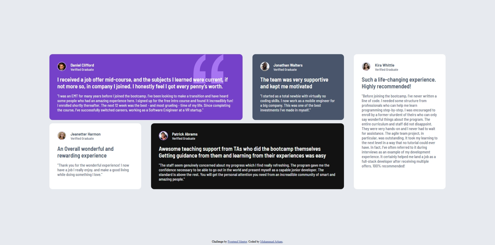

# Frontend Mentor - Testimonials grid section solution

This is a solution to the [Testimonials grid section challenge on Frontend Mentor](https://www.frontendmentor.io/challenges/testimonials-grid-section-Nnw6J7Un7). Frontend Mentor challenges help you improve your coding skills by building realistic projects. 

## Table of contents

- [Overview](#overview)
  - [The challenge](#the-challenge)
  - [Screenshot](#screenshot)
  - [Links](#links)
- [My process](#my-process)
  - [Built with](#built-with)
  - [What I learned](#what-i-learned)
- [Author](#author)

**Note: Delete this note and update the table of contents based on what sections you keep.**

## Overview

This project showcases a visually engaging testimonial grid, designed using HTML & CSS, to highlight user feedback in an organized layout. The grid dynamically arranges multiple testimonials from verified graduates, making the content structured, readable, and aesthetically pleasing.

### The challenge

Users should be able to:

- View the optimal layout for the site depending on their device's screen size
- Enhance readability by prioritizing content hierarchy and spacing.
- Implement media queries to maintain responsiveness across devices.
- Demonstrate effective use of CSS Grid for a modern, structured layout

### Screenshot



### Links

- Solution URL: [View Source Code](https://github.com/testmonial-grid)
- Live Site URL: [Visit Site](https://fa23bcs233.github.io/testmonial-grid)

## My process

### Built with

- Semantic HTML5 markup
- CSS custom properties
- Flexbox
- CSS Grid
- Mobile-first workflow


### What I learned

Building the testimonial grid using HTML & CSS helped me master CSS Grid for structured layouts, refining skills in column and row spanning, responsive design, and precise element placement. I learned to utilize  with  and  to ensure flexibility, while  and  allowed for strategic positioning of items. Implementing  ensured elements stayed centered even after wrapping. Additionally, using  for ordering refined content hierarchy. This project significantly strengthened my understanding of modern layout techniques, making me more confident in handling complex designs and responsiveness in real-world applications.

To see how you can add code snippets, see below:

```html
  <main>
    <section class="testmonial-grid" aria-label="Testmonial Grid">
      <div class="card" data-text-color="light" data-color="purple">
        <div class="info">
          <div class="image-container">
            
          </div>

          <div class="name-job-title">
            <h5>Daniel Clifford</h5>
            <span>Verified Graduate</span>
          </div>
        </div>

        <h5>I received a job offer mid-course, and the subjects I learned were current, if not more so, in company I
          joined. I honestly feel I got every penny's worth.</h5>

        <p>"I was an EMT for many years before I joined the bootcamp. I've been looking to make a transition and have
          heard some people who had an amazing experience here. I signed up for the free intro course and found it
          increadibly fun! I enrolled shortly thereafter. The next 12 week was the best - and most grueling - time of my
          life. Since completing the course, I've successfully switched careers, working as a Software Enigineer at a VR
          startup."</p>
      </div>
      <div class="card"  data-text-color="light" data-color="gray">
        <div class="info">
          <div class="image-container">
            
          </div>

          <div class="name-job-title">
            <h5>Jonathan Walters</h5>
            <span>Verified Graduate</span>
          </div>
        </div>

        <h5>The team was very supportive and kept me motivated</h5>

        <p>"I started as a total newbie with virtually no coding skills. I now work as a mobile engineer for a big
          company. This was one of the best investments I've made in myself."</p>
      </div>
      <div class="card"  data-text-color="dark" data-color="white">
        <div class="info">
          <div class="image-container">
            
          </div>

          <div class="name-job-title">
            <h5>Jeanetter Harmon</h5>
            <span>Verified Graduate</span>
          </div>
        </div>

        <h5>An Overall wonderful and rewarding experience</h5>

        <p>"Thank you for the wonderful experience! I now have a job I really enjoy, and make a good living while doing
          something I love."</p>
      </div>
      <div class="card"  data-text-color="light" data-color="black">
        <div class="info">
          <div class="image-container">
            
          </div>

          <div class="name-job-title">
            <h5>Patrick Abrams</h5>
            <span>Verified Graduate</span>
          </div>
        </div>

        <h5>Awesome teaching support from TAs who did the bootcamp themselves Getting guidance from them and learning
          from their experiences was easy</h5>

        <p>"The staff seem genuinely concerned about my progress which I find really refreshing. The program gave me the
          confidence necessary to be able to go out in the world and present myself as a capable jonior developer. The
          standard is above the rest. You will get the personal attention you need from an increadible community of
          smart and amazing people."</p>
      </div>
      <div class="card"  data-text-color="dark" data-color="white">
        <div class="info">
          <div class="image-container">
            
          </div>

          <div class="name-job-title">
            <h5>Kira Whittle</h5>
            <span>Verified Graduate</span>
          </div>
        </div>

        <h5>Such a life-changing experience. Highly recommended!</h5>

        <p>"Before joining the bootcamp, I've never written a line of code. I needed some structure from professionals
          who can help me learn programming step-by-step. I was encouraged to enroll by a former sturdent of theirs who
          can only say wonderful things about the program. The entire curriculum and staff did not disappoint. They were
          very hands-on and I never had to wait for assistance. The agile team project, in particular, was outstanding.
          It took my learning to the next level in a way that no tutorial could ever have. In fact, I've often referred
          to it during interviews as an example of my development experience. It certainly helped me land a job as a
          full-stack developer after receiving multiple offers. 100% recommended!</p>
      </div>
    </section>
  </main>
```
```css
@media  (min-width: 1024px) {
    .testmonial-grid{
        grid-template-columns: repeat(4 , minmax(210px, 1fr));
    }

    .testmonial-grid > :first-child{
        grid-column: span 2;
        position: relative;
    }

    .card:first-child::after{
        content: "";
        background-image: url("./images/bg-pattern-quotation.svg");
        width: 115px;
        height: 115px;
        background-size: contain;
        display: inline-block;
        position: absolute;
        top: 0px;
        right: 10%;
        z-index: 1;
    }

    .card *{
        position: relative;
        z-index: 10;
    }

    .testmonial-grid > :nth-child(3){
        grid-row: 2/3;
        grid-column: 1/2;
    }

    .testmonial-grid > :nth-child(4){
        grid-column: span 2;
    }

    .testmonial-grid > :last-child{
        grid-row: 1/3;
        grid-column: 4/5;
    }
}
```


## Author

- Name - [Muhammad Arham](#)
- Frontend Mentor - [@FA23BCS233](https://www.frontendmentor.io/profile/fa23bcs233)
